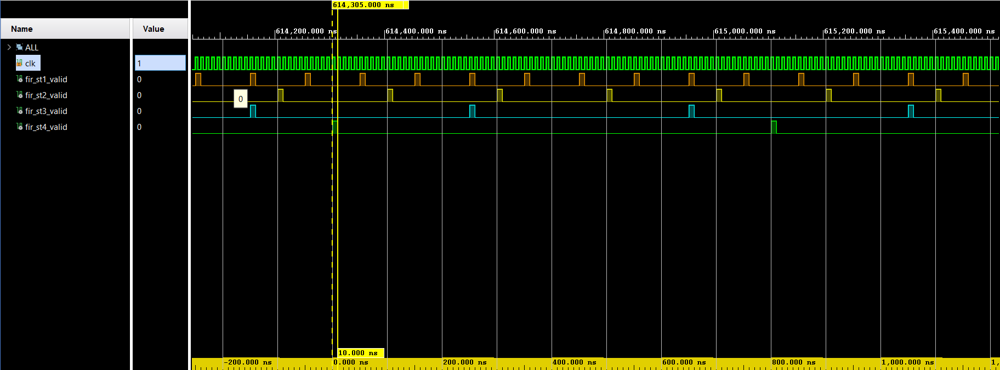
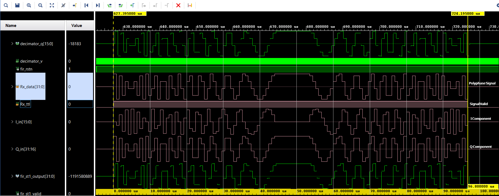
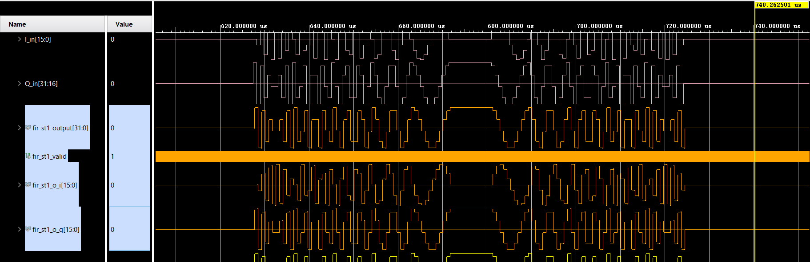
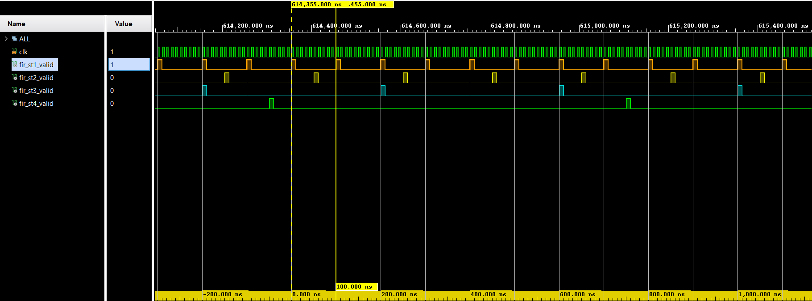
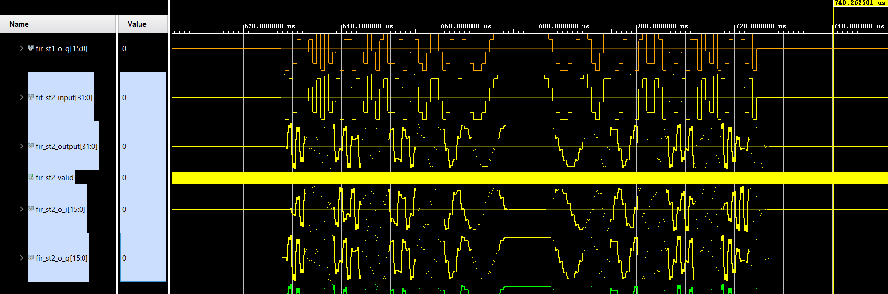
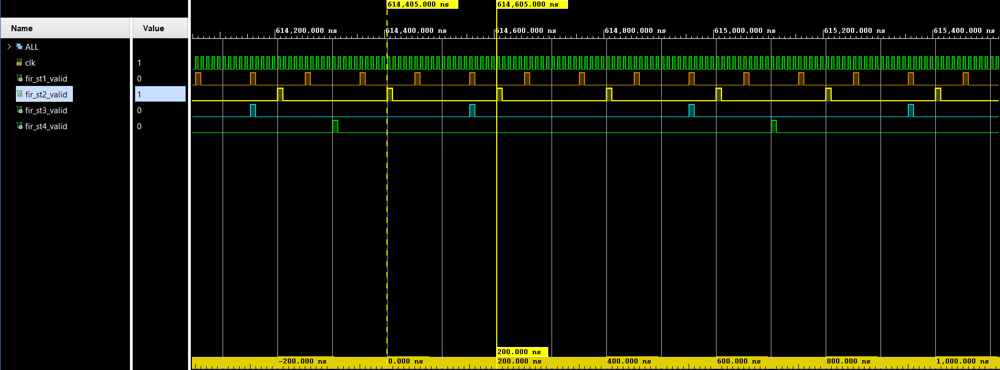
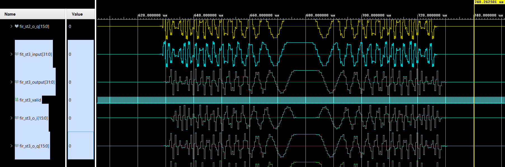
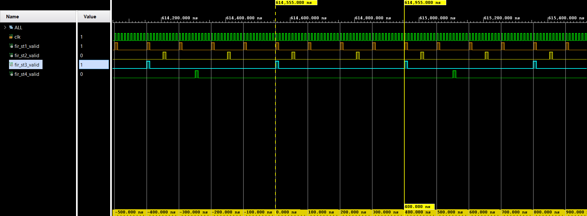
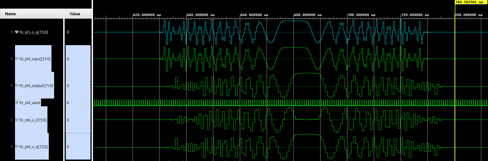
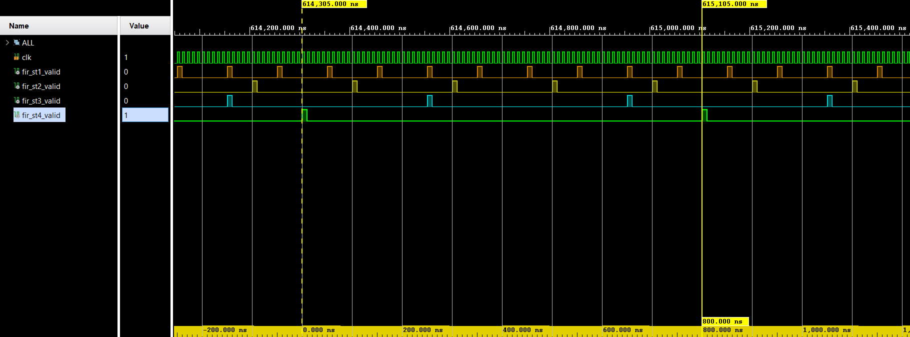

# Simulation Results & Waveform Analysis: Configurable FIR Decimator

This directory contains simulation waveforms captured from the **AMD Vivado Simulator (xsim)** verifying the multi-stage FIR decimation architecture on the **AMD Zynq™ UltraScale+™ MPSoC**.

---

## 📸 Waveform Directory Manifest

| Image File | Description | Key Metric Verified |
|:---|:---|:---|
| [`00_clock_frequency.png`](00_clock_frequency.png) | Clock & Stage Valid Strobe Timing Comparison | Concurrent multi-rate valid timing across all 4 FIR stages |
| [`01_Input_Signal.png`](01_Input_Signal.png) | Analog Input Complex Radar Signal | 100 MSPS In-Phase ($I$) and Quadrature ($Q$) signal envelope |
| [`02_Stage_1_decimation.png`](02_Stage_1_decimation.png) | Stage 1 Decimated Complex Signal | $10\times$ decimation ($100\text{ MSPS} \rightarrow 10\text{ MSPS}$) waveform |
| [`03_Stage_1_valid.png`](03_Stage_1_valid.png) | Stage 1 Valid Strobe Periodicity | Periodic $100\text{ ns}$ strobe ($10\text{ MHz}$) |
| [`04_Stage_2_decimation.png`](04_Stage_2_decimation.png) | Stage 2 Decimated Complex Signal | $20\times$ cumulative decimation ($5\text{ MSPS}$) waveform |
| [`05_Stage_2_valid.png`](05_Stage_2_valid.png) | Stage 2 Valid Strobe Periodicity | Periodic $200\text{ ns}$ strobe ($5\text{ MHz}$) |
| [`06_Stage_3_decimation.png`](06_Stage_3_decimation.png) | Stage 3 Decimated Complex Signal | $40\times$ cumulative decimation ($2.5\text{ MSPS}$) waveform |
| [`07_Stage_3_valid.png`](07_Stage_3_valid.png) | Stage 3 Valid Strobe Periodicity | Periodic $400\text{ ns}$ strobe ($2.5\text{ MHz}$) |
| [`08_Stage_4_decimation.png`](08_Stage_4_decimation.png) | Stage 4 Decimated Complex Signal | $80\times$ cumulative decimation ($1.25\text{ MSPS}$) waveform |
| [`09_Stage_4_valid.png`](09_Stage_4_valid.png) | Stage 4 Valid Strobe Periodicity | Periodic $800\text{ ns}$ strobe ($1.25\text{ MHz}$) |

---

## 🔍 Detailed Waveform Analysis

### 1. Multi-Rate Clock & Stage Valid Comparison

* **Clock Frequency (`clk`):** Period = $10.0\text{ ns}$ ($F_{\text{clk}} = 100\text{ MHz}$).
* **Stage 1 Valid (`fir_st1_valid`):** Pulses high every $100\text{ ns}$ (10 clock cycles $\rightarrow 10\text{ MSPS}$).
* **Stage 2 Valid (`fir_st2_valid`):** Pulses high every $200\text{ ns}$ (20 clock cycles $\rightarrow 5\text{ MSPS}$).
* **Stage 3 Valid (`fir_st3_valid`):** Pulses high every $400\text{ ns}$ (40 clock cycles $\rightarrow 2.5\text{ MHz}$).
* **Stage 4 Valid (`fir_st4_valid`):** Pulses high every $800\text{ ns}$ (80 clock cycles $\rightarrow 1.25\text{ MHz}$).
* **Analysis:** Confirms that all four decimation stages concurrently maintain exact harmonic power-of-two timing relationships driven from the single 100 MHz reference clock.

---

### 2. Input Complex Signal Envelope

* **Signals Displayed:**
  * `I_in[15:0]`: In-Phase 16-bit signed sample stream at 100 MSPS.
  * `Q_in[31:16]`: Quadrature 16-bit signed sample stream at 100 MSPS.
  * `PolyphaseSignal`: Interleaved 32-bit input vector.
  * `SignalValid`: Active stream qualifier.
* **Analysis:** The input signal presents a high-frequency polyphase complex radar pulse with continuous streaming samples.

---

### 3. Stage 1 Decimation Results ($\div 10 \rightarrow 10\text{ MSPS}$)

#### Waveform Response

#### Timing Strobe

* **Decimation Factor:** $10\times$ downsampling.
* **Effective Sampling Rate:** $10\text{ MSPS}$.
* **Analysis:** The 21-tap FIR anti-aliasing filter effectively removes high-frequency components beyond the 4 MHz Nyquist band. The decimated components `fir_st1_o_i` and `fir_st1_o_q` show smooth downsampled sinusoids sampled on each `fir_st1_valid` assertion.

---

### 4. Stage 2 Decimation Results ($\div 2 \rightarrow 5\text{ MSPS}$)

#### Waveform Response

#### Timing Strobe

* **Decimation Factor:** Additional $\div 2$ ($20\times$ cumulative decimation).
* **Effective Sampling Rate:** $5\text{ MSPS}$.
* **Strobe Period:** $200\text{ ns}$ (20 master clock periods).
* **Analysis:** Stage 2 preserves envelope fidelity while halving the output sample rate. Out-of-band alias components are attenuated prior to downsampling.

---

### 5. Stage 3 Decimation Results ($\div 2 \rightarrow 2.5\text{ MSPS}$)

#### Waveform Response

#### Timing Strobe

* **Decimation Factor:** Additional $\div 2$ ($40\times$ cumulative decimation).
* **Effective Sampling Rate:** $2.5\text{ MSPS}$.
* **Strobe Period:** $400\text{ ns}$ (40 master clock periods).
* **Analysis:** Demonstrates steady-state narrow-band filtering. The valid strobe pulse width remains exactly 1 master clock cycle ($10\text{ ns}$) repeating every $400\text{ ns}$.

---

### 6. Stage 4 Decimation Results ($\div 2 \rightarrow 1.25\text{ MSPS}$)

#### Waveform Response

#### Timing Strobe

* **Decimation Factor:** Additional $\div 2$ ($80\times$ cumulative decimation).
* **Effective Sampling Rate:** $1.25\text{ MSPS}$.
* **Strobe Period:** $800\text{ ns}$ (80 master clock periods).
* **Analysis:** Final decimation stage producing low-rate baseband complex samples suitable for Doppler FFT processing and matched filtering with reduced computational overhead.

---

## 📈 Timing & Decimation Verification Matrix

| Stage | Input Rate | Stage Decimation | Output Rate | Target Period | Measured Period | Status |
|:---:|:---:|:---:|:---:|:---:|:---:|:---:|
| **Stage 1** | 100.0 MSPS | $\div 10$ | 10.00 MSPS | 100.0 ns | 100.0 ns | **PASS** |
| **Stage 2** | 10.0 MSPS  | $\div 2$  | 5.00 MSPS  | 200.0 ns | 200.0 ns | **PASS** |
| **Stage 3** | 5.0 MSPS   | $\div 2$  | 2.50 MSPS  | 400.0 ns | 400.0 ns | **PASS** |
| **Stage 4** | 2.5 MSPS   | $\div 2$  | 1.25 MSPS  | 800.0 ns | 800.0 ns | **PASS** |
